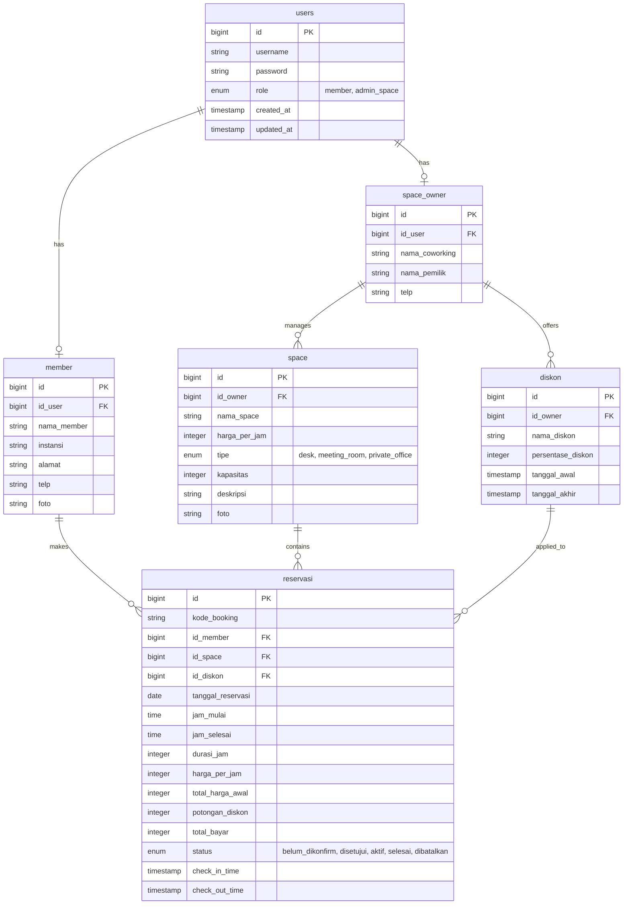

# Database Schema

*Trace: PDF "Desain Database" & DTO Contracts*

## 1. ERD (Entity Relationship Diagram)

## 2. Table Definitions (Migration-Ready)

### `users`
- `id` (bigint, unsigned, primary key)
- `username` (string, unique) - *Source: LoginDto*
- `password` (string) - *Source: LoginDto*
- `role` (enum: `'member'`, `'admin_space'`)
- *timestamps*

### `member`
- `id` (bigint, unsigned, primary key)
- `id_user` (bigint, unsigned, foreign key -> users.id)
- `nama_member` (string) - *Source: RegisterMemberDto*
- `instansi` (string) - *Source: RegisterMemberDto*
- `alamat` (string) - *Source: RegisterMemberDto*
- `telp` (string) - *Source: RegisterMemberDto*
- `foto` (string, nullable) - *Source: RegisterMemberDto*

### `space_owner`
- `id` (bigint, unsigned, primary key)
- `id_user` (bigint, unsigned, foreign key -> users.id)
- `nama_coworking` (string) - *Source: RegisterAdminSpaceDto*
- `nama_pemilik` (string) - *Source: RegisterAdminSpaceDto*
- `telp` (string) - *Source: RegisterAdminSpaceDto*

### `space`
- `id` (bigint, unsigned, primary key)
- `id_owner` (bigint, unsigned, foreign key -> space_owner.id)
- `nama_space` (string) - *Source: CreateSpaceDto*
- `harga_per_jam` (integer) - *Source: CreateSpaceDto*
- `tipe` (enum: `'desk'`, `'meeting_room'`, `'private_office'`) - *Source: CreateSpaceDto*
- `kapasitas` (integer) - *Source: CreateSpaceDto*
- `deskripsi` (text) - *Source: CreateSpaceDto*
- `foto` (string, nullable) - *Source: CreateSpaceDto*

### `diskon`
- `id` (bigint, unsigned, primary key)
- `id_owner` (bigint, unsigned, foreign key -> space_owner.id)
- `nama_diskon` (string, unique) - *Source: CreateDiskonDto* — `[ASSUMPTION]` PDF does not explicitly state promo codes must be globally unique, but `POST /diskon/check` looks up by `nama_diskon` alone with no owner scoping, implying it functions as a lookup key. Treating it as unique per space_owner (not globally) is safer — add a composite unique index on (`id_owner`, `nama_diskon`) instead of a single-column unique constraint.
- `persentase_diskon` (integer) - *Source: CreateDiskonDto*
- `tanggal_awal` (timestamp) - *Source: CreateDiskonDto*
- `tanggal_akhir` (timestamp) - *Source: CreateDiskonDto*

### `reservasi`
- `id` (bigint, unsigned, primary key)
- `kode_booking` (string, unique) - *Source: Reservasi & Payment Entity*
- `id_member` (bigint, unsigned, foreign key -> member.id)
- `id_space` (bigint, unsigned, foreign key -> space.id)
- `id_diskon` (bigint, unsigned, nullable, foreign key -> diskon.id)
- `tanggal_reservasi` (date) - *Source: CreateReservasiDto*
- `jam_mulai` (time) - *Source: CreateReservasiDto*
- `jam_selesai` (time) - *Computed constraint* (Added to ERD from DTO output requirement)
- `durasi_jam` (integer) - *Source: CreateReservasiDto*
- `harga_per_jam` (integer) - *Computed constraint*
- `total_harga_awal` (integer) - *Computed constraint*
- `potongan_diskon` (integer) - *Computed constraint*
- `total_bayar` (integer) - *Computed constraint*
- `status` (enum: `'belum_dikonfirm'`, `'disetujui'`, `'aktif'`, `'selesai'`, `'dibatalkan'`)
- `check_in_time` (timestamp, nullable) - *Source: POST check-in endpoint*
- `check_out_time` (timestamp, nullable) - *Source: POST check-out endpoint*

> **Server-Calculated Variables Note**: Fields `jam_selesai`, `total_harga_awal`, `potongan_diskon`, and `total_bayar` MUST be calculated mathematically by the Laravel backend Service at the time of creation. They must never be blindly accepted directly from Client Request payload.
